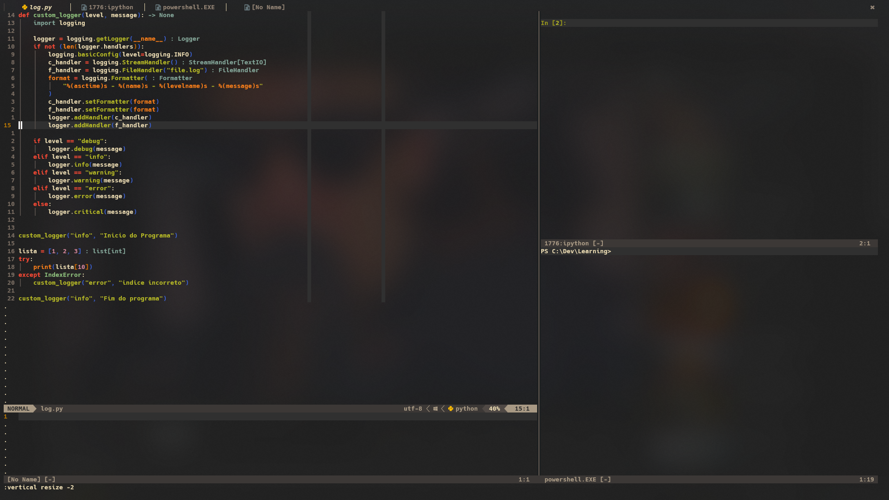

    <h2>My Dotfiles 💻</h2>

[**Neovim**](https://github.com/ElcomJ/dotfiles/tree/master/.config/nvim) 
[**Tmux**](https://github.com/ElcomJ/dotfiles/tree/master/.config/tmux) 
[**Ranger**](https://github.com/ElcomJ/dotfiles/tree/master/.config/ranger) 

[**Scripts**](https://github.com/ElcomJ/dotfiles/tree/master/scripts) 

    <h2>My Neovim Setup 💻</h2>

